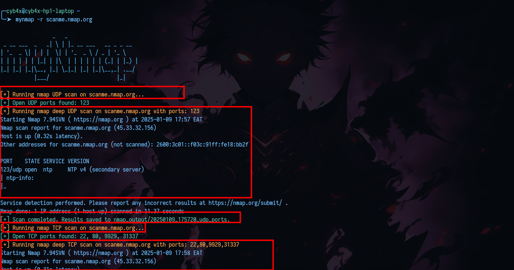
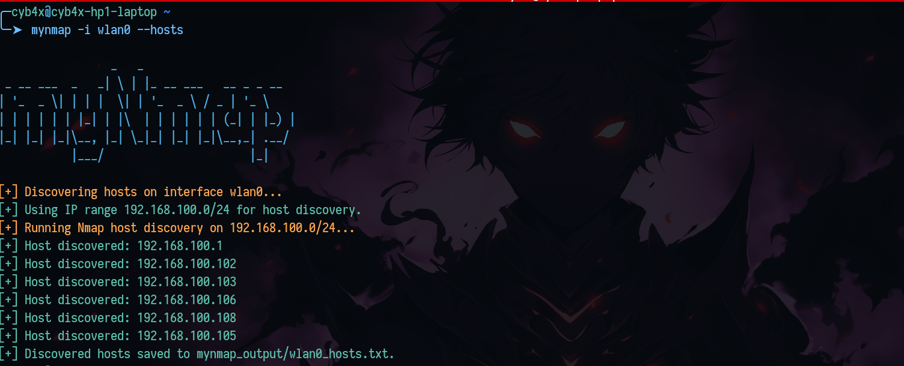

# mynmap

`mynmap` is a simplified wrapper for Nmap, designed to make network scanning quick and effortless. This tool is perfect for those who want to avoid writing long and complex Nmap commands. It abstracts away the intricacies of Nmap's syntax, allowing users to perform scans by specifying only the essentials.

---


## Features

- **TCP and UDP Scans**: Choose between TCP and UDP scans with Nmap.
- **Host discovery**: Performs host discovery.
- **Flexible Target Specification**: Scan single IPs, IP ranges, subnets, or use a file for input.
- **Save and Display Results**: Outputs scan results both on the terminal and saves them to a file.

---

## Requirements

- Python 3.6+
- Nmap installed and accessible via the command line.

---

## Installation

## Downloading my nmap binary
Follow these steps to download mynmap on your system:

### 1. Download the precompiled binary:

Use `wget` to download the binary file from the GitHub releases page:

```bash
wget https://github.com/cyb4x/myNmap/releases/download/mynmap/mynmap
```

### 2. Move the binary:
```bash
sudo cp mynmap /usr/local/bin
```

### 3. Executable permission:
```bash
sudo chmod +x /usr/local/bin/mynmap
```

### 4. Verify Installation:
```bash
mynmap --help
```

## Alternatively Clone and Install

Follow these steps to download mynmap on your system:

1. Clone the repository:
   ```bash
   git clone https://github.com/cyb4x/myNmap.git
   ```
2. Navigate to the project directory:
   ```bash
   cd myNmap
   ```
3. Run the setup script to install dependencies and create the binary:
   ```bash
   sudo python3 setup.py
   ```
---

## Usage

### Basic Syntax

```bash
sudo mynmap -t <scan_type> [-f <file>] [-r <targets>]
```

### Examples

#### Default TCP&UDP Scan (if `-t` is not specified)
```bash
mynmap -r 192.168.1.2
```

#### TCP Scan on a Subnet
```bash
mynmap -t tcp -r 192.168.1.0/24
```

#### UDP Scan on a Range of IPs
```bash
mynmap -t udp -r 192.168.1.1-192.168.1.10
```

#### Scan Hosts from a File
```bash
mynmap -t tcp -f targets.txt
```

#### 4. Discover hosts on a specific interface
```bash
mynmap --hosts -i eth0
```
---

## Output

- Results are displayed on the terminal during the scan.
- A detailed scan report is saved in the `nmap_output/` directory with filenames corresponding to the scan type, e.g., `nmap_output/tcp_ports` or `nmap_output/udp_ports`.

---





## Help Menu

Access the help menu for detailed options:
```bash
mynmap -h
```

---

## Contributing

1. Fork the repository.
2. Create a feature branch:
   ```bash
   git checkout -b feature-name
   ```
3. Commit changes:
   ```bash
   git commit -m "Add your message here"
   ```
4. Push to your fork and create a pull request.

---

## License

This project is licensed under the MIT License. See the [LICENSE](LICENSE) file for details.

---
